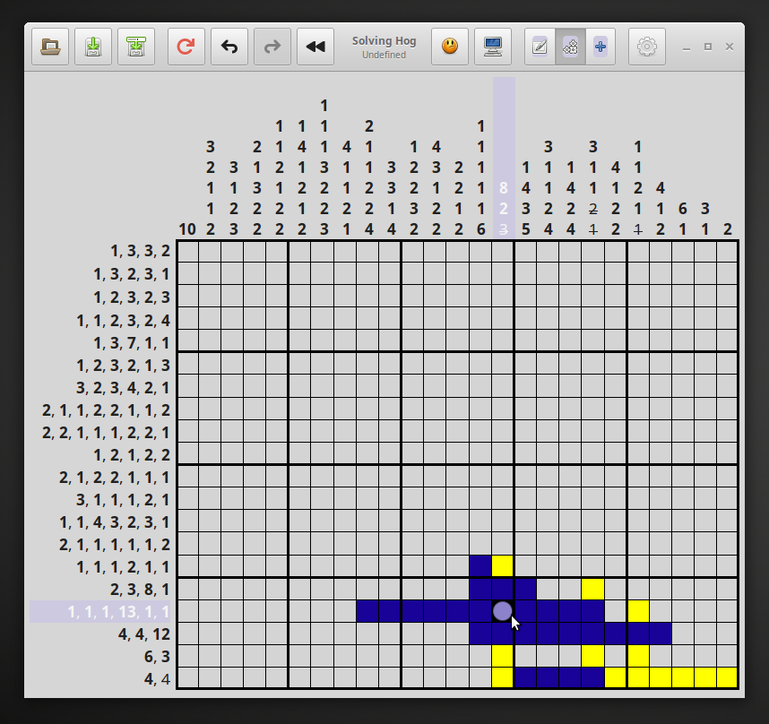

#  Gnonograms
Nonogram puzzle game written in Vala/Gtk and intended primarily for elementaryos but this version will compile
and run on older machines and distros.

[](http://www.gnu.org/licenses/gpl-3.0)



### Dependencies
These dependencies must be present before building
 - `valac`
 - `meson`
 - `gtk+-3.0`
 - `granite`
 - `desktop-file-utils`
 - `appstream`

 You can install these on a Ubuntu-based system by executing this command:

 `sudo apt install valac meson  desktop-file-utils appstream libgranite-dev`

If your distro does not have the right version of libgranite then try adding the elementary-os repository:

`sudo add-apt-repository ppa:elementary-os/stable`
`sudo apt-get update`

### Building
```
meson build --prefix=/usr  --buildtype=release
cd build
ninja
```

### Installing & executing
```
sudo ninja install
com.github.jeremypw.gnonograms
```

### Uninstalling
```
In original build directory:

sudo ninja uninstall
sudo ./post_uninstall.py
```
You can alternatively download the deb package from the `packaging` directory and install it with gdebi or similar.
